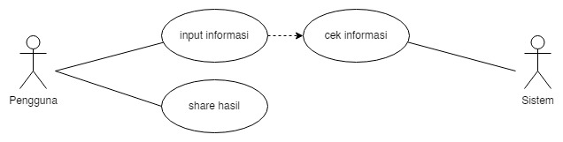
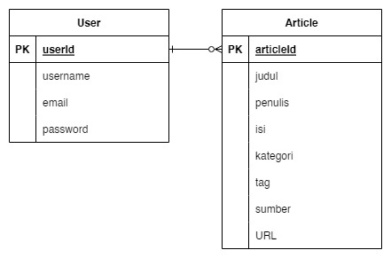
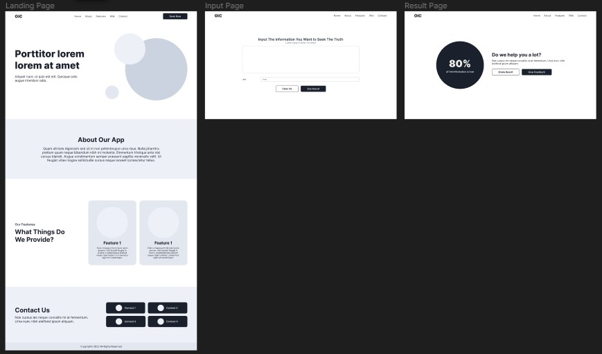
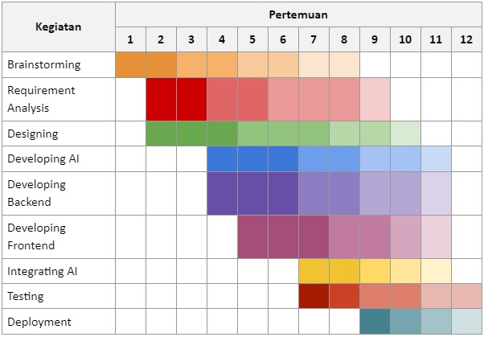

<h1 align="center">OiC</h1>

Simple web-based application for fake news detection.  
<a href="https://sidqiaverroes.github.io/OiC-Senior-Project/">Github Page</a>

<h2>Kelompok Mentri</h2>
Ketua Kelompok: <a href="https://github.com/sidqiaverroes">Sidqi Averroes</a> - 20/460568/TK/51157 
Anggota 1: <a href="https://github.com/adyasena">Adya Sena Pamungkas</a> - 20/460536/TK/51125 
Anggota 2: <a href="https://github.com/JunianN">Rizky Junian Nugroho</a> - 20/460564/TK/51153

<h4 align="center">Project Senior Project TI</h4>

Departemen Teknologi Elektro dan Teknologi Informasi 
Fakultas Teknik, Universitas Gadjah Mada

<h3>Modul 1</h3>

### Nama Produk

OiC

### Jenis Produk

Web-Based Application

### Latar Belakang

Informasi saat ini menjadi salah satu aset yang paling berharga. Namun, terkadang kita sulit membedakan mana informasi yang kredibel dan mana yang palsu. Terutama ketika memasuki periode-periode tertentu, seperti yang sebentar lagi akan dihadapi Indonesia, yaitu Pemilu. Informasi akan dapat menjadi senjata berbahaya karena dapat memecah belah masyarakat ketika masa seperti Pemilu datang. Oleh karena itu, diperlukan suatu alat yang dapat membantu masyarakat untuk membedakan informasi nyata dan palsu.

### Rumusan Permasalahan

*   Bagaimana mengidentifikasi suatu informasi itu asli atau palsu?
*   Bagaimana membuat suatu sistem yang dapat membedakan informasi asli dan palsu?
*   Bagaimana mengimplementasikan AI dalam pembuatan sistem?
*   Bagaimana meningkatkan keakuratan sistem dalam menentukan informasi asli atau palsu?

### Ide Solusi

Sebuah aplikasi berbasis website untuk mendeteksi berita palsu.

| Fitur	            | Keterangan                                          |
| ----------------- | --------------------------------------------------- |
| Information Input | Memasukkan informasi yang ingin dideteksi           |
| Detection Result  | Hasil deteksi informasi apakah asli atau palsu      |
| Share Result      | Membagikan hasil deteksi agar orang lain teredukasi |

### Analisis Kompetitor

#### Kompetitor 1

| -                | -                          |
| ---------------- | -------------------------- |
| Nama             | NewsGuard                  |
| Jenis Kompetitor | Direct                     |
| Jenis Produk     | Pendeteksi keaslian berita |
| Target Customer  | Masyarakat                 |

| Kelebihan                                               | Kekurangan                                                  |
| ------------------------------------------------------- | ----------------------------------------------------------- |
| Memberikan peringkat kredibilitas                       | Terbatas pada bahasa inggris                                |
| Transparansi sumber berita                              | Tidak sepenuhnya otomatis                                   |
| Tim editor manusia                                      | Tidak selalu akurat                                         |
| Menggunakan AI dan algoritma khusus                     | Tidak menyediakan informasi yanglengkap                     |
| Tidak terikat dengan kepentingan politikatau finansial  | Tidak mengatasi masalah sumberberita palsu secara langsung  |

Key Competitive Advantage & Unique Value:
*   Kredibilitas dan transparansi
*   Tim ahli
*   Evaluasi berbasis sumber daya
*   Mempromosikan literasi media
*   Tersedia dalam berbagai platform

#### Kompetitor 2

| -                | -                          |
| ---------------- | -------------------------- |
| Nama             | Oigetit Fake News Filter   |
| Jenis Kompetitor | Direct                     |
| Jenis Produk     | Pendeteksi keaslian berita |
| Target Customer  | Masyarakat                 |

| Kelebihan                               | Kekurangan                               |
| --------------------------------------- | ---------------------------------------- |
| Mudah digunakan                         | Tidak sepenuhnya akurat                  |
| Memeriksa keaslian berita secara cepat  | Terbatas pada bahasa inggris             |
| Menggunakan teknologi AI                | Tidak dapat menangani kontennon-tekstual |
| Mampu mendeteksi berita palsu yangrumit | Tidak mengatasi akar permasalahan        |
| Menyediakan informasi lengkap           | Dapat mengandung bias                    |
| Tersedia di berbagai platform           |                                          |

Key Competitive Advantage & Unique Value:
*   AI dan machine learning
*   Real-time monitoring
*   Customizable filters
*   Integrasi API
*   Data analytics

#### Kompetitor 3

| -                | -                          |
| ---------------- | -------------------------- |
| Nama             | FactMata                   |
| Jenis Kompetitor | Direct                     |
| Jenis Produk     | Pendeteksi keaslian berita |
| Target Customer  | Masyarakat                 |

| Kelebihan                                     | Kekurangan                                        |
| --------------------------------------------- | ------------------------------------------------- |
| Menggunakan teknologi AI                      | Tidak sepenuhnya akurat                           |
| Menerapkan metode kredibilitasberbasis sumber | Tidak selalu terupdate                            |
| Mudah digunakan                               | Terbatas pada bahasa Inggris                      |
| Mengkategorikan tingkat kebenaran             | Memerlukan pengguna aktif                         |
| Mampu menangani berbagai jeniskonten          | Keterbatasan pada kategori yang bisa diverifikasi |

Key Competitive Advantage & Unique Value:
*   Credibility score
*   Natural language processing
*   User-generated content analysis
*   Collaborative moderation
*   Data analytics

<h3>Modul 2</h3>

#### Metodologi SDLC

Dalam pengembangan aplikasi pendeteksi berita palsu, metodologi Agile lebih cocok karena proyek tersebut cenderung kompleks dan memerlukan penyesuaian selama proses pengembangan yang sangat singkat yaitu 12 minggu.

#### Tujuan Produk

Membantu user dalam memilah informasi yang tersebar di internet dan membedakan antara berita yang benar dan palsu. Tujuan lainnya adalah untuk membantu meningkatkan kesadaran masyarakat tentang pentingnya verifikasi informasi sebelum mempercayai dan menyebarkan berita tersebut.

#### Pengguna Potensial dan Kebutuhan Pengguna

Pengguna potensial dari produk adalah masyarakat umum terutama pengguna layanan internet yang membutuhkan kebenaran dari informasi yang dibaca secara akurat dan terpercaya.

#### Use Case Diagram

#### Functional Requirements

| FR   | Deskripsi                                                       |
| ---- | --------------------------------------------------------------- |
| FR 1 | Pengguna dapat menginput informasi dengan sesuai                |
| FR 2 | Pengguna dapat membagikan hasil informasi yang telah divalidasi |
| FR 3 | Sistem dapat mengidentifikasi keaslian informasi dengan akurat  |

#### Entity Relationship Diagram

#### Lo-Fi Wireframe

 

#### Gantt-Chart

